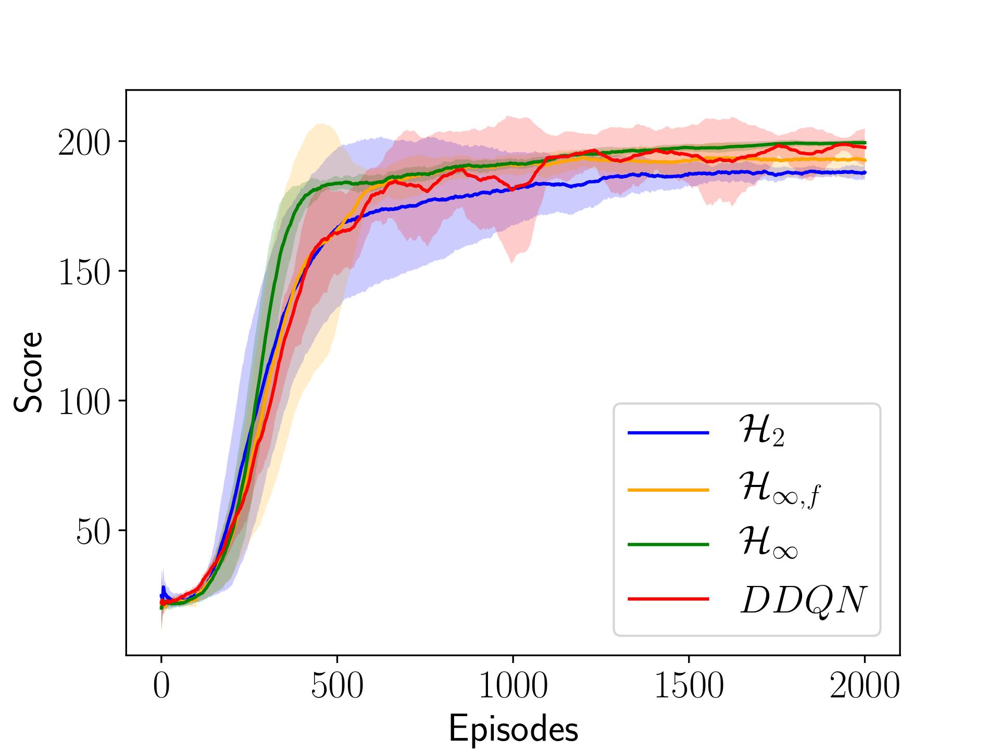
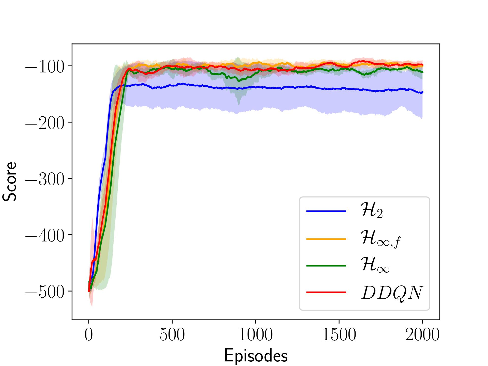

# Deep Q-learning with robust control

**Link 1:** https://arxiv.org/abs/2201.08610

**Link 2:** https://onlinelibrary.wiley.com/doi/10.1002/rnc.6457

**Cite the paper describing the algorithm as:**  

Varga, B, Kulcsár, B, Chehreghani, MH. Deep Q-learning: A robust control approach. Int J Robust Nonlinear Control. 2022; 1- 19. doi:10.1002/rnc.6457

**Description:** Source code for the controlled DQN algorithm in the Cartpole and Acrobot environments. The training is implemented in Python using Torch and OpenAI Gym environments. The `DQN_agent.py` class contains all three controllers (H2, Hinf, fixed structure Hinf). The scripts `Controlled_Cartpole.py` and `Controlled_Acrobot.py` implement the training in the respective environments. Which controlled algorithm to use is selected via: 
```
0: H2
1: Fixed Hinf
2: Dynamic Hinf
CONTROLLER = 1
```
The `Cartpole_Plotter.py` script implements some advanced plotting functions. 

The control design was done with Matlab's Robust Control Toolbox for Dynamic Hinf and Fixed Hinf (code in `Robust_Hinf_dynamical.m` `Robust_Hinf_fixedstruct.m`). Controller gains were copied manually to `DQN_agent.py`. 

# Results




